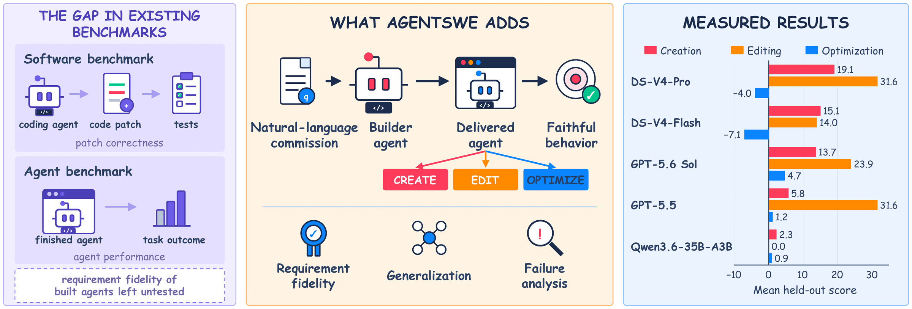
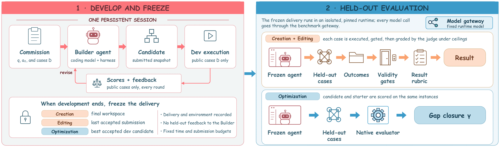

<h1 align="center">AgentSWE</h1>

<p align="center"><b>编码 agent 能造出你真正想要的 agent 吗？</b></p>

<p align="center">
  <a href="https://vectorspacelab.github.io/AgentSWE"></a>
  
  <a href="LICENSE"></a>
</p>

<p align="center">
  <a href="#-新闻">新闻</a> |
  <a href="#-基准">基准</a> |
  <a href="#-结果">结果</a> |
  <a href="#agentswe-lite">Lite</a> |
  <a href="#-快速开始">快速开始</a> |
  <a href="#-引用">引用</a> |
  <a href="README.md">English</a>
</p>

AgentSWE 是一个评测 **agent 软件工程**能力的基准。我们给编码 agent 一份自然语言写的需求，让它构建或修改一个
agent，再用它从没见过的用例去测交付出来的 agent。25 个任务覆盖 agent 生命周期的三个阶段：**创建**（Creation，
10 个）、**修改**（Editing，10 个）和**优化**（Optimization，5 个）。

<p align="center">
  
</p>

## ✨ 亮点

- **覆盖完整生命周期。** 从空目录造一个 agent；给 10 个真实的 agent 项目（Aider、OpenHands、Codex、DeepTutor 等）
  加新功能；或者在 BrowseComp、τ³、Terminal-Bench、PinchBench、OSWorld 上优化一个已经能跑的 agent。
- **是委托，不是考试。** 编码 agent 只看到需求和少量示例用例。它冻结的交付物要在覆盖需求其余部分的隐藏用例上
  运行，先过硬性的通过/失败闸，再按从需求导出的细则评分。优化任务直接用原基准自己的指标。
- **现有编码 agent 都差得远。** Creation 的 50 次运行平均只有 11.2 分（满分 100），其中 20 次是 0 分；优化任务上，
  没有哪个 builder 平均能缩小超过 5% 的差距。
- **上手容易。** 每个任务都在钉住版本的隔离环境里运行。Lite 的 8 个任务只需要一个 DeepSeek API key，建议从 Lite 开始。

## 🔥 新闻

- **2026-10**：开源代码、全部 25 个任务和 Lite 子集。

## 📦 基准

| 阶段 | 起点 | 任务 |
|---|---|---|
| 创建 | 空的工作区 | 授权漏洞验证、数据库分析、桌面 GUI 自动化、文档转可编辑 PPTX、基于证据的文档问答、形式化定理证明、代码库缺陷修复、按 schema 抽取网页、科技论文 PDF 翻译、网络调研报告 |
| 修改 | 钉住版本的真实 agent 项目 | AI-Scientist、Aider、Claude Code、Codex、DeepCode、DeepTutor、Dyad、OpenClaw、OpenHands、OpenWiki |
| 优化 | 一个能运行的起始 agent | BrowseComp、τ³（零售）、Terminal-Bench、PinchBench、OSWorld |

创建和修改任务各有 2 个开发用例和 6 个隐藏用例；优化任务从原基准中取互不重叠的开发子集和隐藏子集。

<p align="center">
  
  <br>
  <em>编码 agent 在公开用例上迭代，冻结后的交付物再在隐藏用例上评测。</em>
</p>

## 📊 结果

5 个 builder 的隐藏用例平均分，全部使用 Codex harness。创建和修改报告 Result（0–100）；优化报告交付物缩小了多少
与目标之间的差距（低于起始 agent 时为负，起始 agent 已接近目标时没有下界）。逐任务结果见论文和[项目主页](https://vectorspacelab.github.io/AgentSWE)。

| Builder | 创建 | 修改 | 优化 |
|---|---:|---:|---:|
| GPT-5.6 Sol | 13.7 | 23.9 | **4.7** |
| GPT-5.5 | 5.8 | **31.6** | 1.2 |
| DeepSeek-V4-Pro | **19.1** | **31.6** | -4.0 |
| DeepSeek-V4-Flash | 15.1 | 14.0 | -7.1 |
| Qwen3.6-35B-A3B | 2.3 | 0.0 | 0.9 |

开发阶段表现出来的，和最终交付的并不是一回事。从运行轨迹看，失败反复落在三类：过拟合可见用例；代码看着完整，
跑起来是空壳；声称已经完成，记录却对不上。

### AgentSWE-Lite

AgentSWE-Lite 是从 25 个任务中选出的 8 个。每个 builder 在 Codex 中各构建 3 次，三个阶段的运行时模型和判官都是
DeepSeek-V4.1-Flash（`deepseek-flash`，profile `lite-v1.1`）。它只需要一个 DeepSeek key，不需要搜索 key，也不需要
发布资产，是评测你自己的编码 agent 最省事的方式。下表是 3 次构建的均值。由于运行时模型和判官与主实验不同，创建和
优化两个阶段的分数水平不能和上面的表比较。

| 阶段 | 任务 | GPT-5.6 Sol | DeepSeek-V4.1-Flash | Qwen3.6-35B-A3B |
|---|---|---:|---:|---:|
| 创建 | 科技论文 PDF 翻译（`pdf`） | 18.9 | **31.9** | 0.0 |
| | 数据库分析（`db`） | 7.4 | **38.7** | 0.0 |
| | 代码库缺陷修复（`repo`） | **42.9** | 30.0 | 0.0 |
| 修改 | DeepTutor 自适应补救（`deeptutor`） | **52.2** | 27.6 | 0.0 |
| | Aider worktree 事务（`aider`） | 13.0 | **39.3** | 6.0 |
| | OpenWiki 变更影响文档（`openwiki`） | **22.8** | 21.0 | 0.0 |
| 优化 | τ³（`tau3`） | 10.1 | **13.0** | 4.3 |
| | PinchBench（`pinch`） | 19.4 | **24.3** | 2.4 |
| **均值** | 创建 / 修改 / 优化 | 23.1 / **29.3** / 14.8 | **33.5** / **29.3** / **18.7** | 0.0 / 2.0 / 3.4 |

## 🚀 快速开始

需要一台装有 Docker 的 Linux x86-64 机器，以及 Python 3.10 或更高版本。部分任务还有额外要求（KVM、带 systemd 的
cgroup v2、大磁盘），`doctor` 会告诉你某个任务需要什么、你的机器是否具备。`pip install -e .` 会装上 `agentswe`
命令，文档里的 `agentswe ...` 就是 `python3 -m agentswe ...` 的简写。

```bash
git clone https://github.com/VectorSpaceLab/AgentSWE.git && cd AgentSWE
cp .env.example .env                  # 把 AGENTSWE_DEFAULT_API_KEY 设为你的 DeepSeek key
python3 -m agentswe list              # 列出 25 个任务
python3 -m agentswe doctor repo       # 检查主机，不调用模型
python3 -m agentswe probe-roles       # 用你的 key 给每个模型角色发一个短请求
python3 -m agentswe setup repo        # 构建任务环境（只需一次）
python3 -m agentswe run repo --builder codex --smoke
python3 -m agentswe status
python3 -m agentswe result <run_id>
```

`--smoke` 用很小的预算检查整条流程能否跑通：只评一个隐藏用例，之前创建任务有一次开发提交，修改任务有两次。网络好的
服务器上，`repo` 首次 setup 加 smoke 需要 25 到 45 分钟；一个修改任务的 smoke 需要 10 分钟到约 2 小时。去掉 `--smoke` 就是按论文
协议完整运行。smoke 的分数不能和论文的数字比较。

网络调研、PPTX 和 BrowseComp 三个任务还需要兼容 Serper 的搜索 key。在防火墙或代理之后使用，见
[docs/ENV.md](docs/ENV.md)。

### 跑 Lite（推荐）

Lite 的 8 个任务是 `repo`、`db`、`pdf`（创建），`deeptutor`、`aider`、`openwiki`（修改），`tau3`、`pinch`（优化）。
用 Lite profile 时，所有角色都用 DeepSeek-V4.1-Flash（`deepseek-flash`），与上面 Lite 结果的设置一致。

```bash
echo AGENTSWE_PROFILE=lite-v1.1 >> .env
python3 -m agentswe doctor repo db pdf deeptutor aider openwiki tau3 pinch
python3 -m agentswe setup <task>
python3 -m agentswe run <task> --builder codex
```

三个修改任务还需要带 systemd 委派的 cgroup v2，`doctor` 会检查。

## 📚 文档（英文）

- [docs/ENV.md](docs/ENV.md)：模型角色、搜索 key、镜像和代理、Docker 地址池
- [profiles/README.md](profiles/README.md)：`paper` 和 `lite-v1.1` 两套配置
- [docs/DESIGN.md](docs/DESIGN.md)：任务注册表、runner 接口、测试
- [THIRD_PARTY.md](THIRD_PARTY.md)：上游项目及其许可证

## 🙏 致谢

AgentSWE 的每个任务都通过 [Harbor](https://github.com/harbor-framework/harbor) 运行，并改编了许多开源 agent 和基准，
完整列表及许可证见 [THIRD_PARTY.md](THIRD_PARTY.md)。

## 📝 引用

```bibtex
@misc{wang2026agentswe,
  title  = {AgentSWE: Can Coding Agents Build the Agent You Actually Want?},
  author = {Jiahao Wang and Hongjin Qian and Yuyang Hu and Jiajun Zhang and Zheng Liu},
  year   = {2026},
  note   = {arXiv preprint coming soon}
}
```

## 许可证

Apache License 2.0，见 [LICENSE](LICENSE) 和 [NOTICE](NOTICE)。各任务的上游项目保留各自的许可证，在 setup 时下载，
不在本仓库中再分发。
