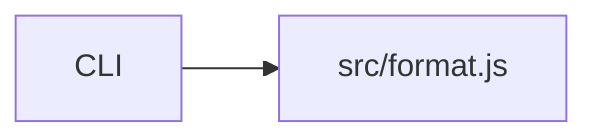

# Module layout

<!-- openwiki:generated:start id="module-layout-diagram" -->

```mermaid
flowchart LR
  CLI --> LegacyFormat[src/format.js]
```
<!-- openwiki:generated:end id="module-layout-diagram" -->
